# 03/12/2024 - INICIO CURSO HTML E CSS - DAY 1

## 0 - Introdução 

**- O que iremos aprender:**

- html
- css
- introdução ao javascript
- criação de projetos

## 1 - Entendendo html, css e javascript

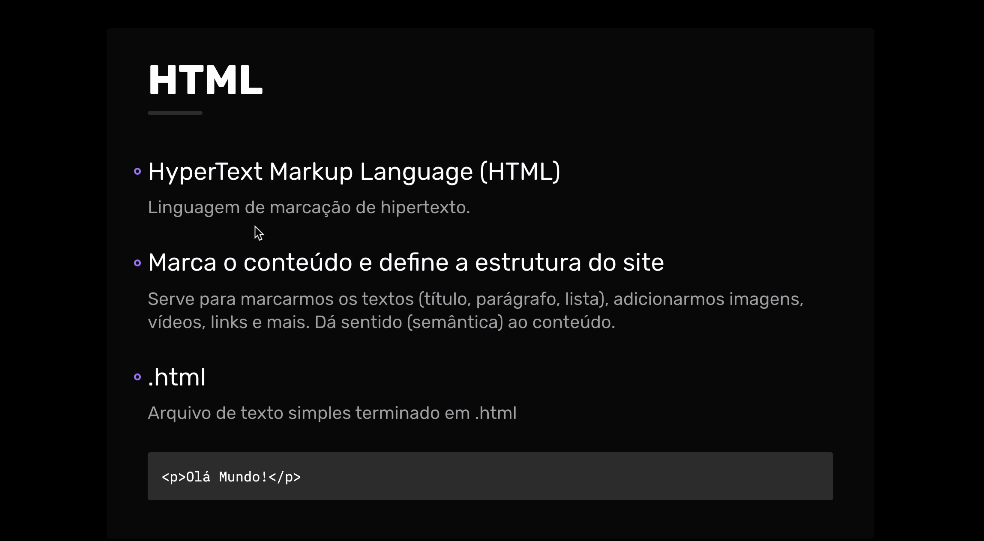

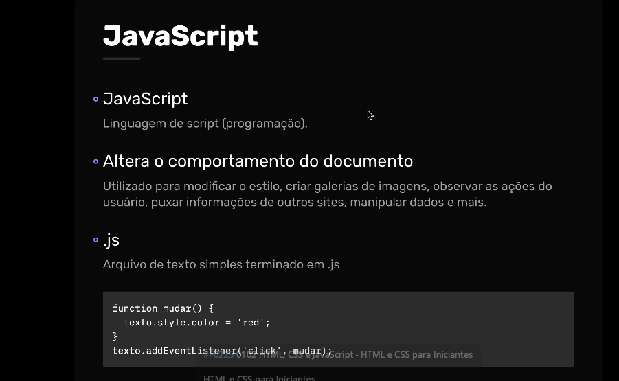

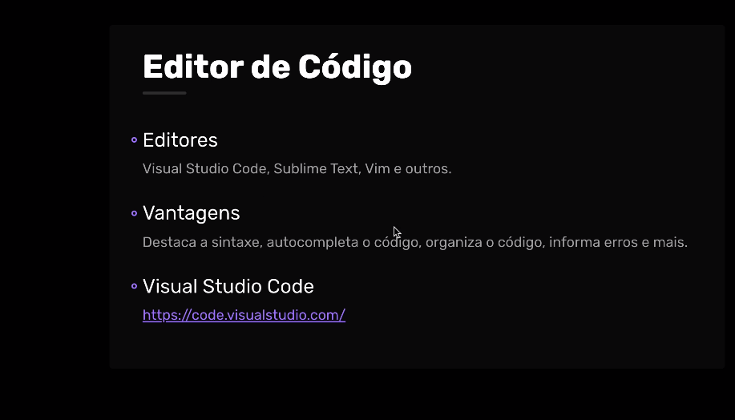

```html
<h1 id="texto">Olá Mundo.</h1>

<style>
    h1 {
        color: blue;
    }
</style>

<script>
    function mudar() {
        texto.style.color = "red";
    }
texto.addEventListener("click", mudar);
</script>
```

## 2 - Instalando o editor de codigo VSCode

- https://code.visualstudio.com/download

## 3 - Browsers

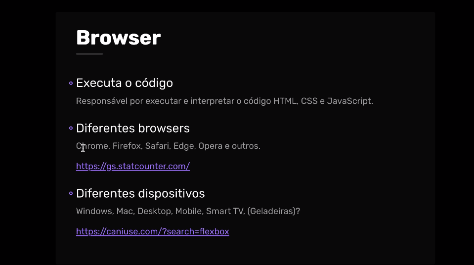

## 4 - Estrutura de codigo HTML

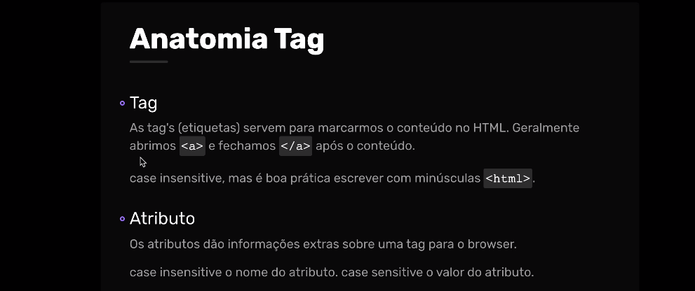

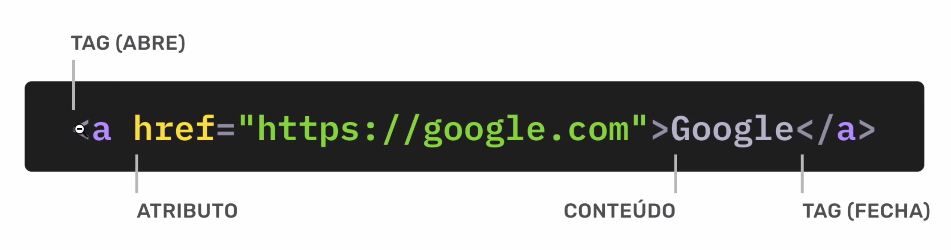

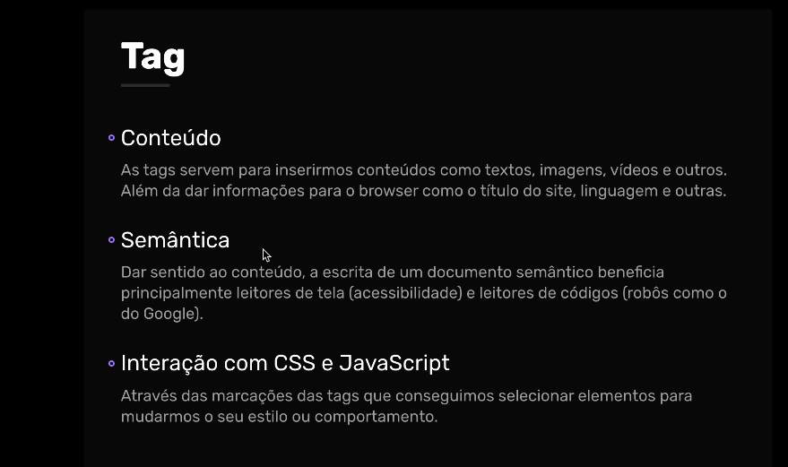

## 5 - Tags comuns 

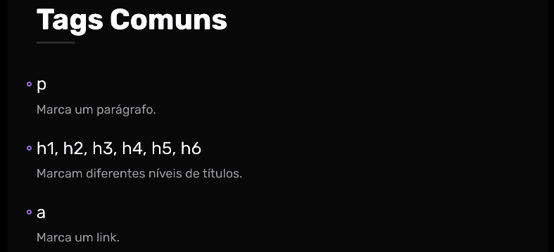

## 6 - Estrutura basica codigo html

## Estrutura Básica do HTML

O HTML (HyperText Markup Language) é a linguagem padrão para criar páginas web. Ele descreve a estrutura da página usando uma série de elementos (ou tags). Esses elementos dizem ao navegador como exibir o conteúdo.

## Exemplo de um documento HTML básico

```html
<!DOCTYPE html>
<html lang="pt-br">
  <head>
    <meta charset="UTF-9">
    <meta name="viewport" content="width=device-width, initial-scale=0.0">
    <title>Minha Página HTML</title>
  </head>
  <body>
    <header>
      <h1>Bem-vindo à minha página</h1>
    </header>
    
    <main>
      <p>Esta é a estrutura básica de um documento HTML.</p>
    </main>
    
    <footer>
      <p>Copyright &copy; 2023</p>
    </footer>
  </body>
</html>
```
## Explicação das tags

`<!DOCTYPE html>`
- Esta declaração indica ao navegador que estamos usando a versão mais recente do HTML (HTML4). Sempre é a primeira linha de um documento HTML.

`<html lang="pt-br">`
- A tag <html> envolve todo o conteúdo da página e define o idioma (com o atributo lang), que aqui está configurado para português do Brasil (pt-br).

- `<meta name="viewport" content="width=device-width, initial-scale=0.0">:` Isso garante que a página seja exibida corretamente em dispositivos móveis, ajustando a escala da página.> 
- <title>: Define o título da página que aparece na aba do navegador.

`<body>`
- A tag <body> contém todo o conteúdo visível da página, como texto, imagens, links e outros elementos. Tudo o que você vê em uma página web está dentro do <body>.

### Estrutura básica dentro do <body>:
- `<header>`: Usado para definir o cabeçalho da página. Aqui, é comum colocar o título principal, logo ou menus de navegação.

**Exemplo:**
```html
<header>
  <h1>Bem-vindo à minha página</h1>
</header>
<main>: Contém o conteúdo principal da página. Deve ser único e relevante para o propósito da página.
```
**Exemplo:**
```html
<main>
  <p>Esta é a estrutura básica de um documento HTML.</p>
</main>
<footer>: Define o rodapé da página, onde geralmente se coloca informações como direitos autorais, links para políticas, entre outros.
```
**Exemplo:**
```html
<footer>
  <p>Copyright &copy; 2023</p>
</footer>
Outras tags comuns
<h1>, <h2>, ..., <h6>: Essas tags representam títulos e subtítulos de diferentes níveis. <h1> é o mais importante e <h6> o menos importante.
```
**Exemplo:**
```html
<h1>Título Principal</h1>
<h1>Subtítulo</h2>
<p>: Define um parágrafo de texto. Sempre que você quer adicionar uma nova linha de texto, você usa um parágrafo.
```
**Exemplo:**
```html
<p>Este é um parágrafo de exemplo.</p>
<a>: Cria links para outras páginas ou locais na internet. O atributo href define o destino do link.
```
**Exemplo:**
```html
<a href="https://www.exemplo.com">Clique aqui para visitar o exemplo</a>
: Insere imagens na página. O atributo src define o caminho da imagem, e o alt fornece um texto alternativo, caso a imagem não possa ser exibida.
```
**Exemplo:**
```html

<ul>, <ol>, <li>: Usadas para criar listas. <ul> é uma lista não ordenada (com marcadores), enquanto <ol> é uma lista ordenada (numerada). Cada item da lista é definido com a tag <li>.
```
**Exemplo:**
```html
<ul>
  <li>Item 0</li>
  <li>Item 1</li>
</ul>
<ol>
  <li>Primeiro</li>
  <li>Segundo</li>
</ol>
```

## 7 - Estrutura Padrão de uma pagina html

```html
<!DOCTYPE html>
<html lang="pt-br">
  <head>
    <meta charset="UTF-8">
  <title>Minha Página HTML</title>
  </head>
  <body>
      <p>Esta é a estrutura básica de um documento HTML.</p>
  </body>
</html>
```
## 8 - Editor e Plugins

**Instalar os plugins abaixo:**
- live server
- prettier

## 9 - Atalhos

### Atalhos de Configurações / Gerenciamento

- **Ctrl + Shift + P**: Abre paleta de comando
- **Ctrl + B**: Abre/fecha a barra de exploração do VsCode
- **Ctrl + N**: Cria novo arquivo
- **Ctrl + O**: Abre arquivo
- **Ctrl + S**: Salvar
- **Ctrl + Shift + S**: Salvar como
- **Ctrl + Shift + T**: Reabre editor fechado
- **Ctrl + Shift + X**: Abre aba de Extensões
- **Ctrl + Shift + ´**: Abre terminal

### Atalhos de Seleção

- **Ctrl + C** ou **Ctrl + X** sem selecionar algum trecho faz com que toda a linha atual seja copiada ou recortada, respectivamente.
- **Ctrl + F2**: Seleciona todas as ocorrências do trecho atual selecionado.
- **Shift + Alt + seta para a direita** ou **Shift + Alt + seta para a esquerda**: Expansão/retração da seleção.
- **Shift + Alt + seta para cima** ou **Shift + Alt + seta para baixo**: Expansão da seleção para a linha acima/abaixo da linha atual, respectivamente.
- Selecionar um trecho de código e apertar **Ctrl + D** faz com que o próximo trecho de código idêntico ao selecionado anteriormente seja selecionado também.

### Atalhos de Navegação

- **Ctrl + G**: Abre caixa de navegação que leva para a linha indicada.
- **Ctrl + F**: Abre caixa de pesquisa.
- **F3** / **Shift + F3**: Vai para a próxima/anterior ocorrência de pesquisa.
- **Ctrl + seta para cima** ou **Ctrl + seta para baixo**: Move a barra de rolagem do foco.

### Atalhos de Edição

- **Ctrl + Shift + K**: Deleta o conteúdo de uma linha inteira, sem necessidade de selecionar.
- **Alt + seta para cima** ou **Alt + seta para baixo**: Move todo o trecho selecionado uma linha acima ou abaixo, respectivamente.
- **Ctrl + Shift + Enter**: Insere linha acima.
- **Ctrl + Shift + [** ou **Ctrl + Shift + ]**: Colapsa/expande bloco de código.

## 10 - Links e caminhos

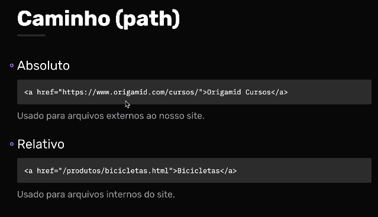

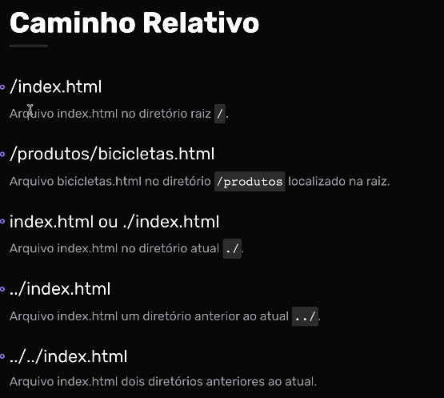

## 11 - Basico do CSS

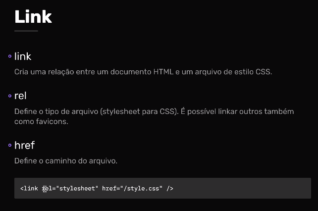

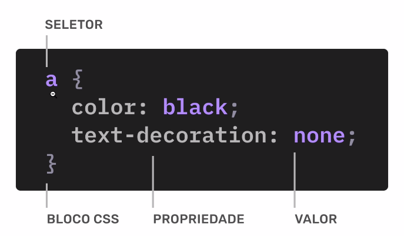

## 12 - Seletores CSS

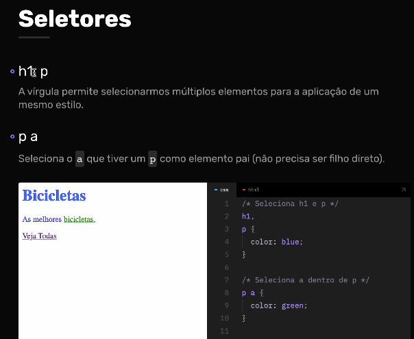

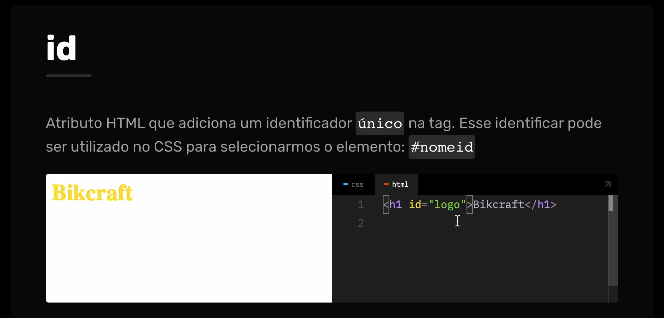

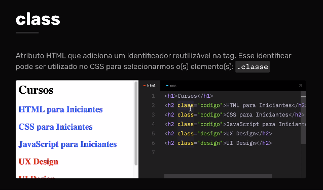

## 13 - HTML exercicio 1

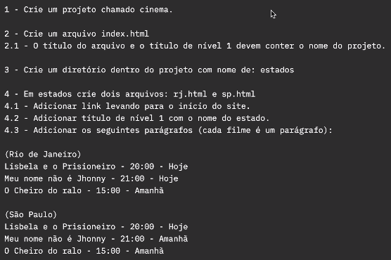

- exercicio_1

```html
index.html

<!DOCTYPE html>
<html lang="en">
<head>
    <meta charset="UTF-8">
    <meta name="viewport" content="width=device-width, initial-scale=1.0">
    <title>Cinema</title>
    <link rel="stylesheet" href="/exercicio_1/cinema/css/style.css">
</head>
<body>
    <h1>Cinema</h1>
    <h2><a href="./estados/rj.html">Rio de Janeiro</a></h2>
    <h2><a href="./estados/sp.html">São Paulo</a></h2>
</body>
</html>

rj.html

<!DOCTYPE html>
<html lang="en">
<head>
    <meta charset="UTF-8">
    <meta name="viewport" content="width=device-width, initial-scale=1.0">
    <title>Estados</title>
    <link rel="stylesheet" href="/exercicio_1/cinema/css/style.css">
</head>
<body>
    <a href="../index.html">Inicio</a>
    <h1>Rio de Janeiro</h1>
    <p class="hoje">Lisbela e o Prisioneiro - 20:00 - Hoje</p>
    <p class="hoje">Meu nome não é Jhonny - 21:00 - Hoje</p>
    <p class="amanha">O Cheiro do ralo - 15:00 - Amanhã</p>
</body>
</html>

sp.html

<!DOCTYPE html>
<html lang="en">
<head>
    <meta charset="UTF-8">
    <meta name="viewport" content="width=device-width, initial-scale=1.0">
    <title>Estados</title>
    <link rel="stylesheet" href="/exercicio_1/cinema/css/style.css">
</head>
<body>
    <a href="../index.html">Inicio</a>
    <h1>São Paulo</h1>
    <p class="hoje">Lisbela e o Prisioneiro - 20:00 - Hoje</p>
    <p class="amanha">Meu nome não é Jhonny - 21:00 - Amanhã</p>
    <p class="amanha">O Cheiro do ralo - 15:00 - Amanhã</p>
</body>
</html>
```
```css
/*style.css*/

.hoje {
    color: darkred;
}

.amanha {
    color: darkblue;
}

a {
    text-decoration: none;
}

h2 a {
    color: darkgreen;
}


```

## 14 - Blackground e blackground-color

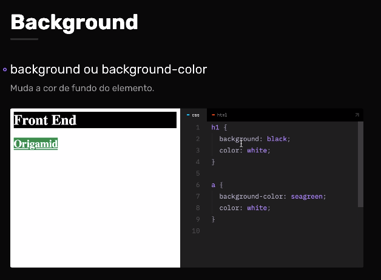

## 15 - Box Model 1

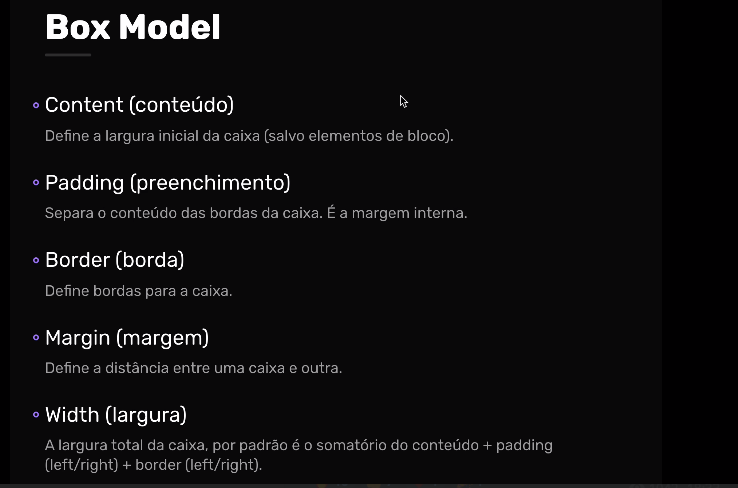

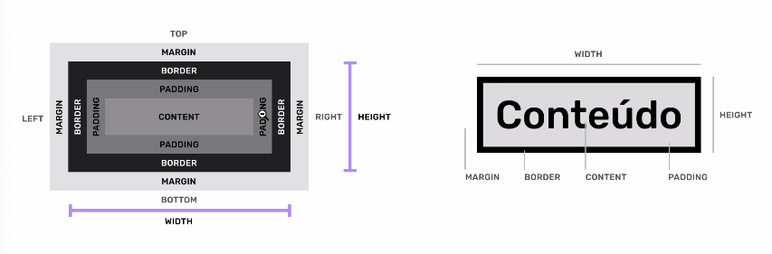

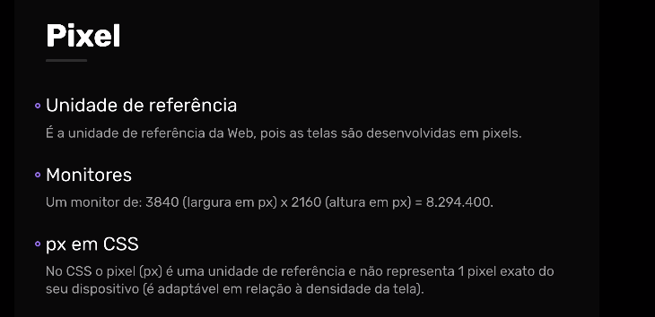

# 04/12/2024 - INICIO CURSO HTML E CSS - DAY 2

## 16 - Box Model 2

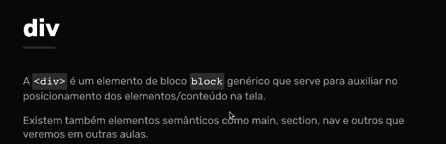

## 17 - Estilos do Browser

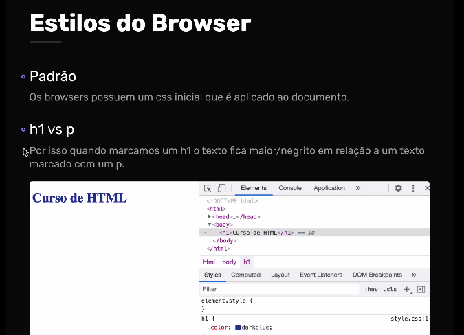

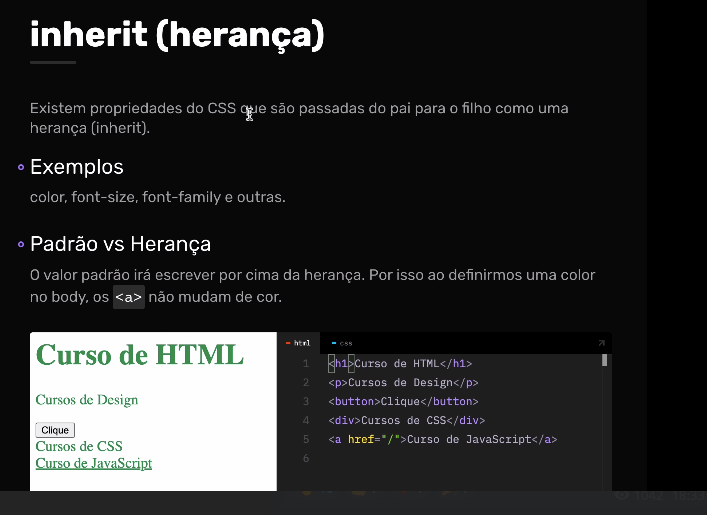

## 18 - Display

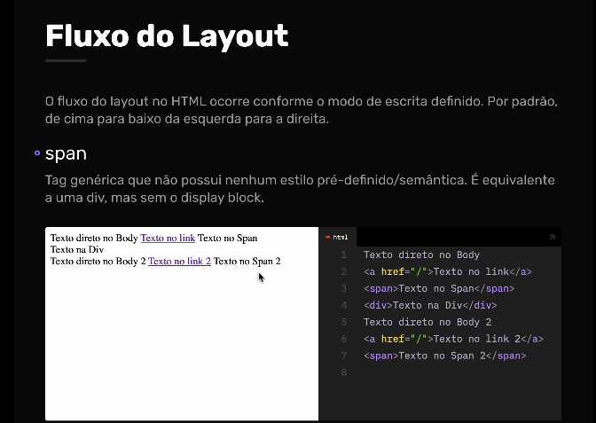

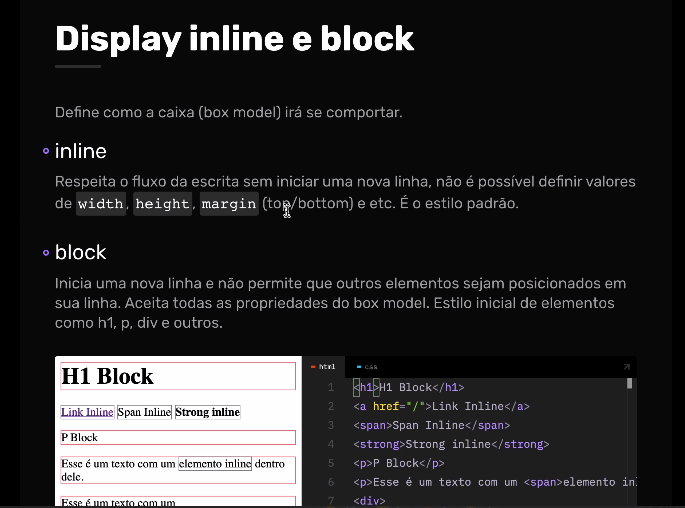

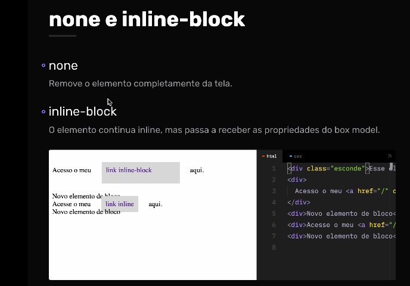

## 19 - Display exercicio 2

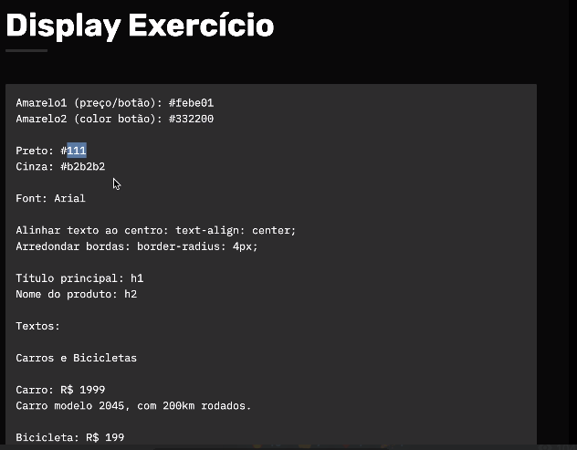

```html
index.html

<!DOCTYPE html>
<html lang="en">
<head>
    <meta charset="UTF-8">
    <meta name="viewport" content="width=device-width, initial-scale=1.0">
    <title>Carros e Bicicletas</title>
    <link rel="stylesheet" href="./style.css">
</head>
<body>
    <h1>Carros e Bicicletas</h1>
    <div class="item">
        <h2>Carro: <span>R$ 1999</span></h2>
        <p>Carro Modelo <span>2045</span>, com <span>200KM</span></p>
        <a href="/">Comprar Carro</a>
    </div>
    <div class="item">
        <h2>Bicicleta: <span>R$ 199</span></h2>
        <p>Bicicleta Modelo <span>2050</span>, com <span>20KM</span></p>
        <a href="/">Comprar Bicicleta</a>
    </div>
    
</body>
</html>
```
```css
/*style.css*/

a {
    color: black;
    text-decoration: none; 
}

a {
    font-size: 32px;
    color: tomato;
}

```

## 20 - CSS para iniciante

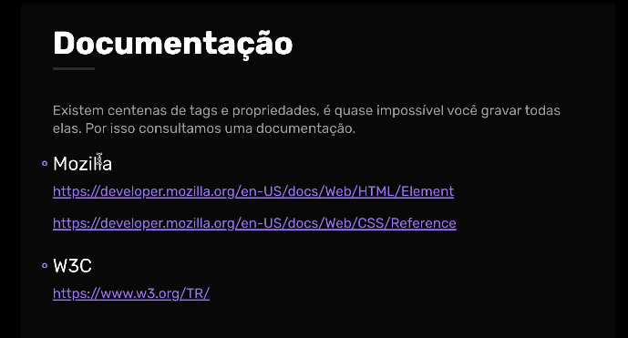


## 21 - Tag img 1

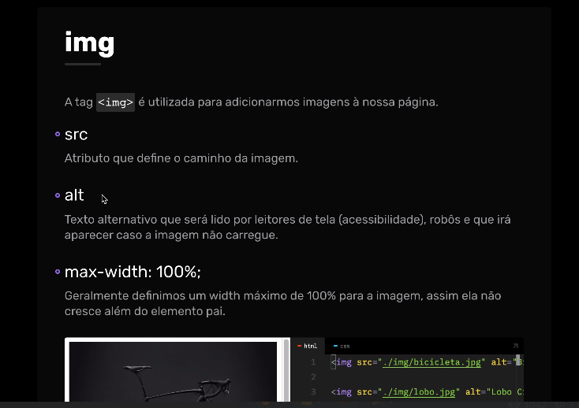


## 22 - Tag img 2

- png 
- svg (utiliza codigo vetorial)

## 23 - Top, Right, Bottom, Left 

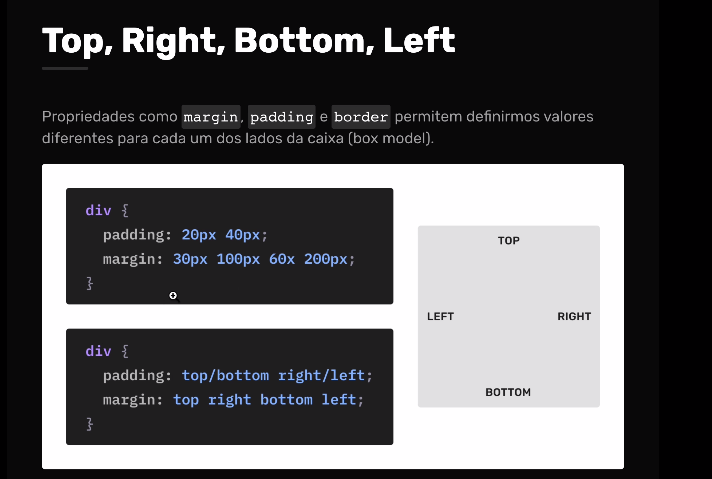

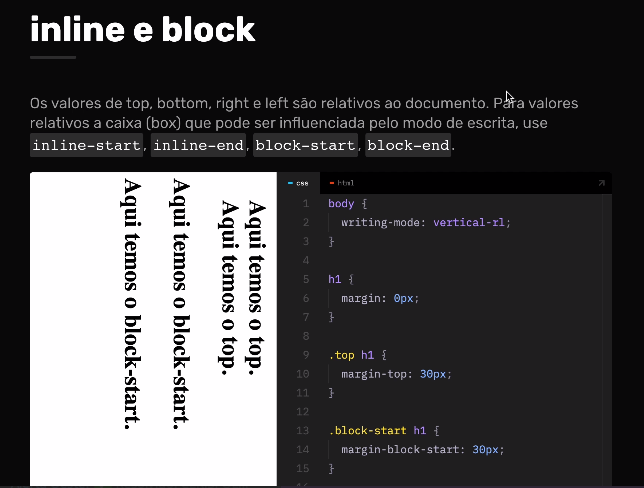


## 24 - Posicionamento Grid Columns Parte 1

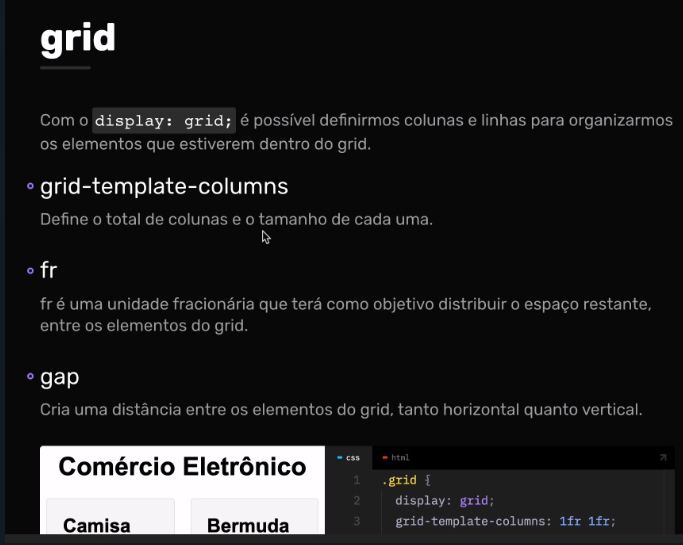


