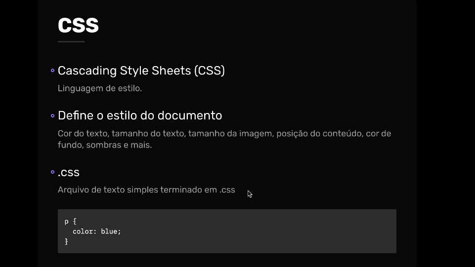
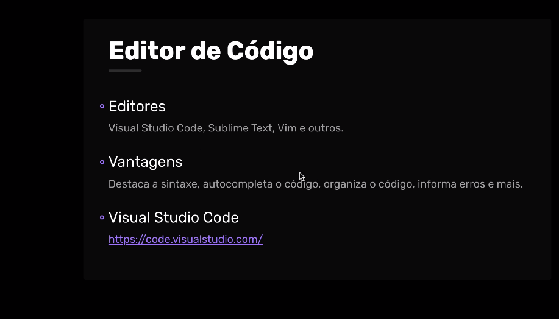
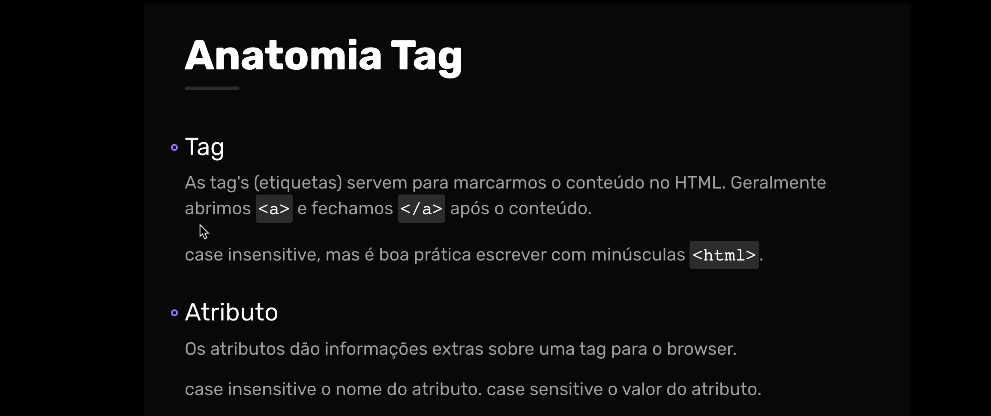

# 04/09/2024 - INICIO CURSO HTML E CSS - DAY 1

## 1 - Introdução 

**- O que iremos aprender:**

- html
- css
- introdução ao javascript
- criação de projetos

## 2 - Entendendo html, css e javascript





```html
<h1 id="texto">Olá Mundo.</h1>

<style>
    h1 {
        color: blue;
    }
</style>

<script>
    function mudar() {
        texto.style.color = "red";
    }
texto.addEventListener("click", mudar);
</script>

```

## 3 - Instalando o editor de codigo VSCode



## 4 - Brouwsers


## 5 - Estrutura de codigo HTML




## 6 - Tags comuns 


## 7 - Estrutura basica codigo html

# Estrutura Básica do HTML

O HTML (HyperText Markup Language) é a linguagem padrão para criar páginas web. Ele descreve a estrutura da página usando uma série de elementos (ou tags). Esses elementos dizem ao navegador como exibir o conteúdo.

## Exemplo de um documento HTML básico

```html
<!DOCTYPE html>
<html lang="pt-br">
  <head>
    <meta charset="UTF-8">
    <meta name="viewport" content="width=device-width, initial-scale=1.0">
    <title>Minha Página HTML</title>
  </head>
  <body>
    <header>
      <h1>Bem-vindo à minha página</h1>
    </header>
    
    <main>
      <p>Esta é a estrutura básica de um documento HTML.</p>
    </main>
    
    <footer>
      <p>Copyright &copy; 2024</p>
    </footer>
  </body>
</html>
```
## Explicação das tags

### <!DOCTYPE html>
- Esta declaração indica ao navegador que estamos usando a versão mais recente do HTML (HTML5). Sempre é a primeira linha de um documento HTML.

### <html lang="pt-br">
- A tag <html> envolve todo o conteúdo da página e define o idioma (com o atributo lang), que aqui está configurado para português do Brasil (pt-br).

### <head>
- A tag <head> contém informações meta sobre a página, como seu título, codificação de caracteres e configuração para dispositivos móveis. Tudo que está dentro dessa tag não é exibido diretamente na página, mas é importante para seu funcionamento.

### Tags importantes dentro do <head>:

- **<meta charset="UTF-8">:** Define a codificação de caracteres como UTF-8, que suporta quase todos os caracteres e símbolos.
- **<meta name="viewport" content="width=device-width, initial-scale=1.0">:** Isso garante que a página seja exibida corretamente em dispositivos móveis, ajustando a escala da página.
- **<title>:** Define o título da página que aparece na aba do navegador.

### <body>
- A tag <body> contém todo o conteúdo visível da página, como texto, imagens, links e outros elementos. Tudo o que você vê em uma página web está dentro do <body>.

### Estrutura básica dentro do <body>:
- **<header>:** Usado para definir o cabeçalho da página. Aqui, é comum colocar o título principal, logo ou menus de navegação.

**Exemplo:**
```html
<header>
  <h1>Bem-vindo à minha página</h1>
</header>
<main>: Contém o conteúdo principal da página. Deve ser único e relevante para o propósito da página.
```
**Exemplo:**
```html
<main>
  <p>Esta é a estrutura básica de um documento HTML.</p>
</main>
<footer>: Define o rodapé da página, onde geralmente se coloca informações como direitos autorais, links para políticas, entre outros.
```

**Exemplo:**
```html
<footer>
  <p>Copyright &copy; 2024</p>
</footer>
Outras tags comuns
<h1>, <h2>, ..., <h6>: Essas tags representam títulos e subtítulos de diferentes níveis. <h1> é o mais importante e <h6> o menos importante.
```

**Exemplo:**
```html
<h1>Título Principal</h1>
<h2>Subtítulo</h2>
<p>: Define um parágrafo de texto. Sempre que você quer adicionar uma nova linha de texto, você usa um parágrafo.
```

**Exemplo:**
```html
<p>Este é um parágrafo de exemplo.</p>
<a>: Cria links para outras páginas ou locais na internet. O atributo href define o destino do link.
```

**Exemplo:**
```html
<a href="https://www.exemplo.com">Clique aqui para visitar o exemplo</a>
: Insere imagens na página. O atributo src define o caminho da imagem, e o alt fornece um texto alternativo, caso a imagem não possa ser exibida.
```

**Exemplo:**
```html

<ul>, <ol>, <li>: Usadas para criar listas. <ul> é uma lista não ordenada (com marcadores), enquanto <ol> é uma lista ordenada (numerada). Cada item da lista é definido com a tag <li>.
```

**Exemplo:**
```html
<ul>
  <li>Item 1</li>
  <li>Item 2</li>
</ul>
<ol>
  <li>Primeiro</li>
  <li>Segundo</li>
</ol>
```

## 8 - Tags comuns

## 9 - Tags comuns


## 10 - Tags comuns

## 11 - Tags comuns

## 12 - Tags comuns